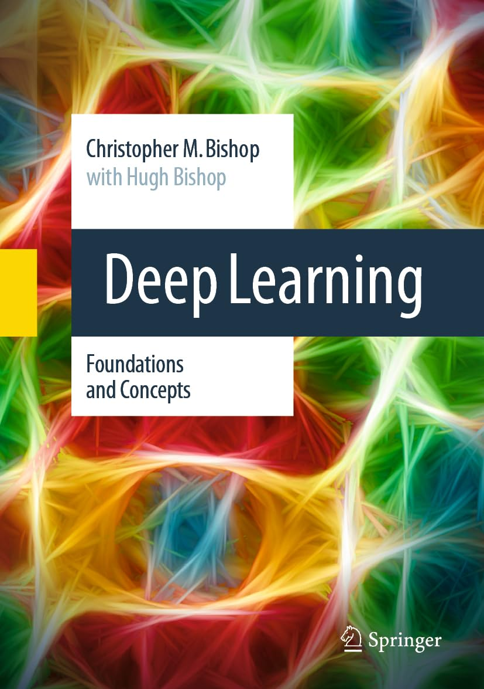

# Deep-Learning---Foundations-and-Concepts

## Tuesday, June 18, 2024

This will be my repository created for the walk through of the book "Deep Learning - Foundations and Concepts" by Christopher Bishop. There is no official repository associated with this book but I thought creating one could be a useful learning exercise.

    I created the conda environment 'dlfac' for this task: 

    1) mamba create -n dlfac python=3.11
    2) mamba activate dlfac
    3) mamba install conda-forge::jupyterlab
    4) mamba install pytorch torchvision torchaudio pytorch-cuda=11.8 -c pytorch -c nvidia
    5) mamba install conda-forge::scikit-learn
    6) mamba install conda-forge::matplotlib

## Thursday, June 20, 2024

    7) mamba install conda-forge::pandas

## Monday, June 24, 2024

Reading through Chapter 2 Probabilities and wondering how to create a notebook to illustrate some of the concepts expressed. 

Hah yeah ... the thought 'Ask ChatGPT to do this' just popped into my head, so let's do that!

    8) mamba install conda-forge::sympy

Damn, Chat GPT is really nailing what I am asking it to do! I sent it an image and ask it to produce the code for it. I also asked Claude to do the same, and it too was pretty damn good!